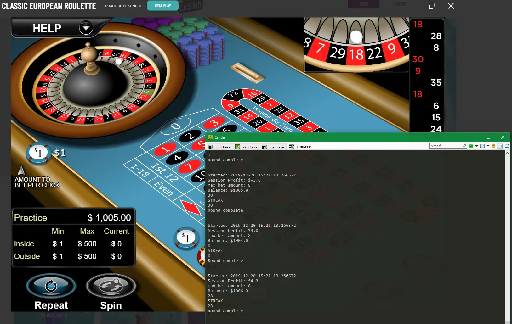

# RouBot

### Disclaimer:

*I've tested 3 different online casinos in **practice-mode only** and even then 1 of my accounts was disabled. While the thought of having a bot program that makes money on the side for you can be a little intoxicating to say the least, don't do it. Bots are against the terms of service on most sites and if you're caught you may not be able to withdraw your funds.*

This was a weekend experiment inspired by a mis-titled Youtube video. It uses a progressive strategy to double up after losses so it never loses. Don't get too excited though. With a betting unit of $1 and a max bet of $500 it does well most of the time, but one bad session can be catastrophic. Still, it's empowering to watch it make 'play' money all on its own.

## Pre-req:

You will need to install [Tesseract-OCR](https://github.com/UB-Mannheim/tesseract/wiki). You need to be able to call it from the command line. Most likely you'll need to add the following environmental variable: `C:\Program Files\Tesseract-OCR\tessdata\`

## Install

+ clone or download

+ cd into the folder

+ `pipenv shell`

+ `pipenv install`

## Usage

+ Open the game window - I suggest Cafe Casino ( no account required )

+ From the terminal:

+ cd into the folder

+ `pipenv shell`

+ `python main.py`

+ Follow the on-screen instructions

Once you finish the configuration, the bot will begin automatically

Please note that it can be difficult to get tesseract to read the game data properly. Depending on the casino you use, you may need to make adjustments to the image manipulations performed on the snapshots of the balance area and the number area to get tesseract-OCR to give you the correct values.

## Questions:

Send your questions to Zach@NerdVenture.net
